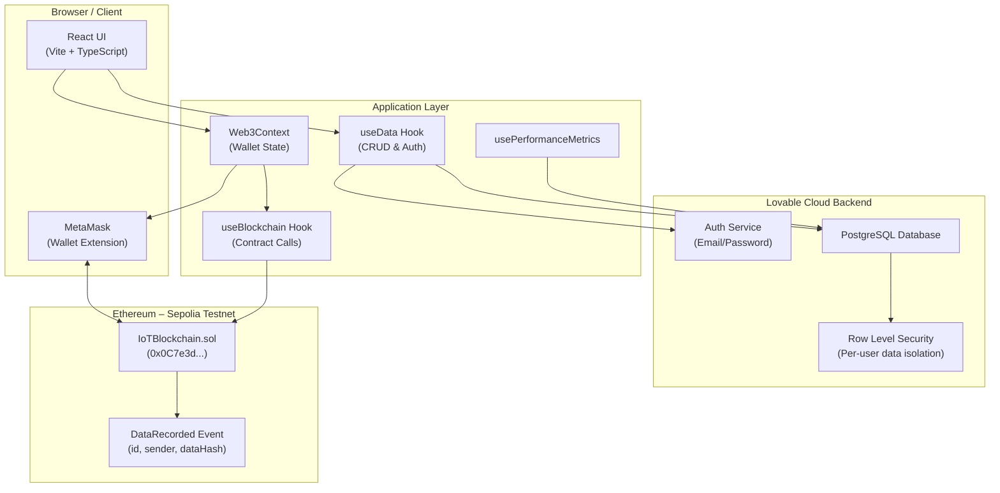
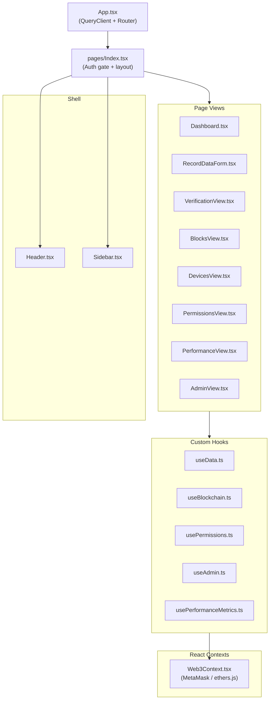
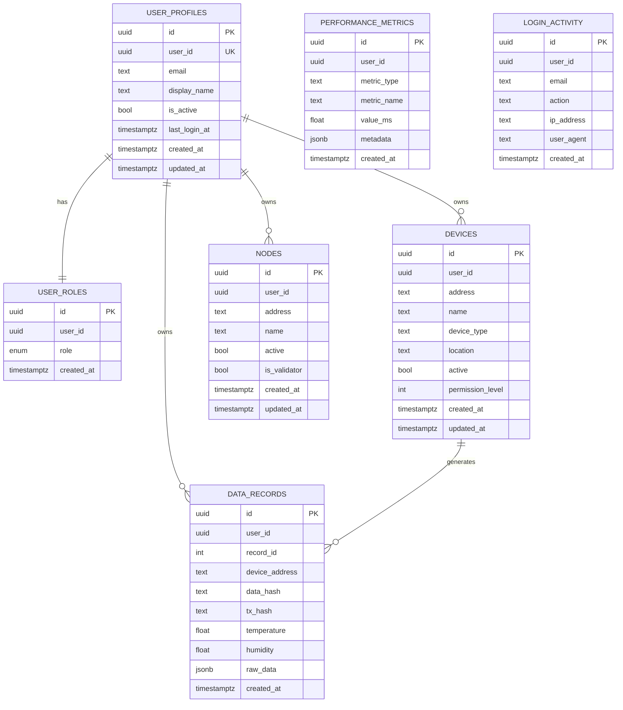
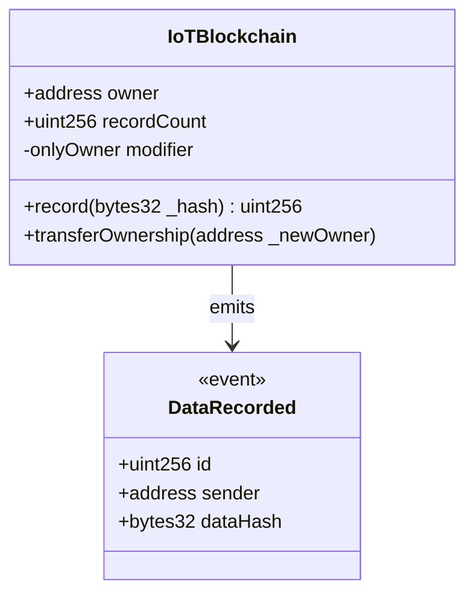

# System Architecture

## Overview

This platform is a **Hybrid IoT Blockchain System** that combines:
- A **React + TypeScript** frontend for user interaction
- A **Lovable Cloud (PostgreSQL/Supabase)** backend for structured data storage
- An **Ethereum smart contract** (Sepolia testnet) for immutable integrity proofs

Data is stored in the database; only cryptographic hashes are written to the blockchain to minimise gas costs.

---

## High-Level Architecture

---

## Component Architecture

---

## Database Schema

---

## Smart Contract

**Network:** Ethereum Sepolia Testnet  
**Address:** `0x0C7e3d4d44b27C0baC12714Bfe3D1B769a0573eB`  
**Design principle:** Proof-only — only `keccak256` hashes are stored on-chain; all metadata lives in the database.
