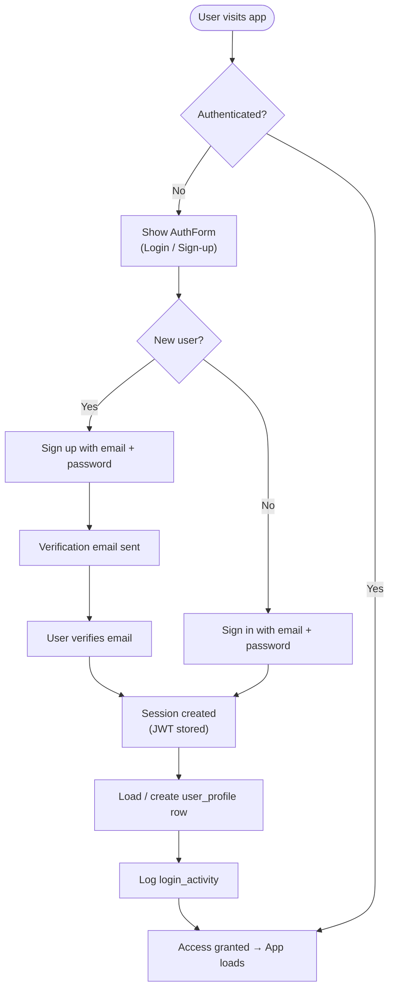
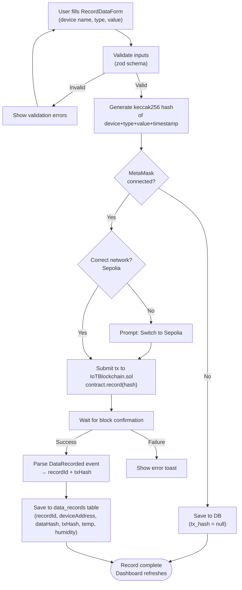
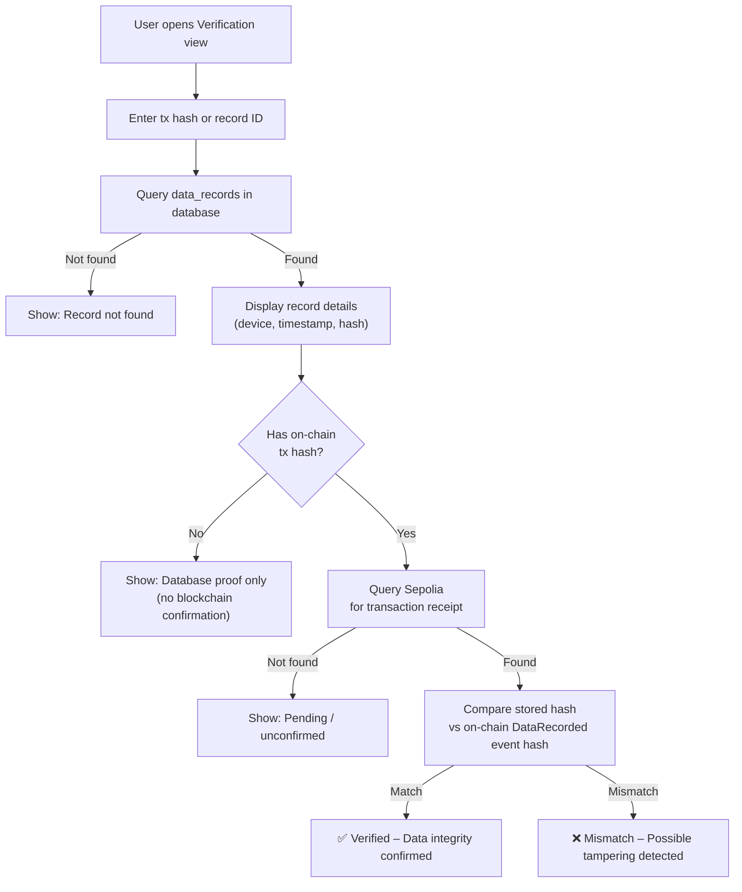
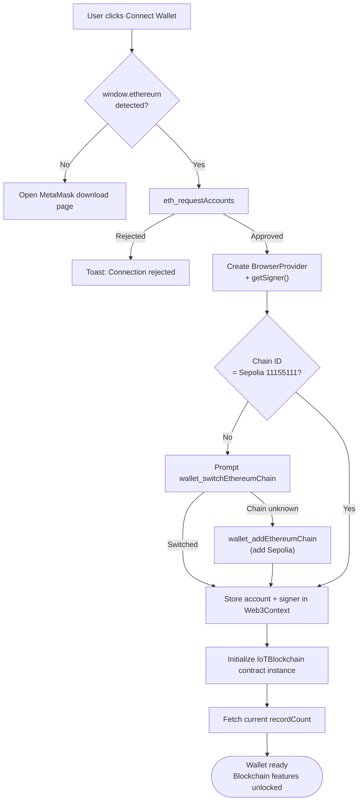
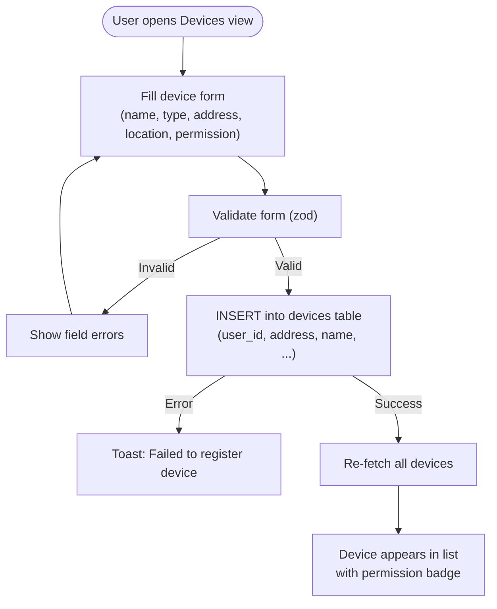
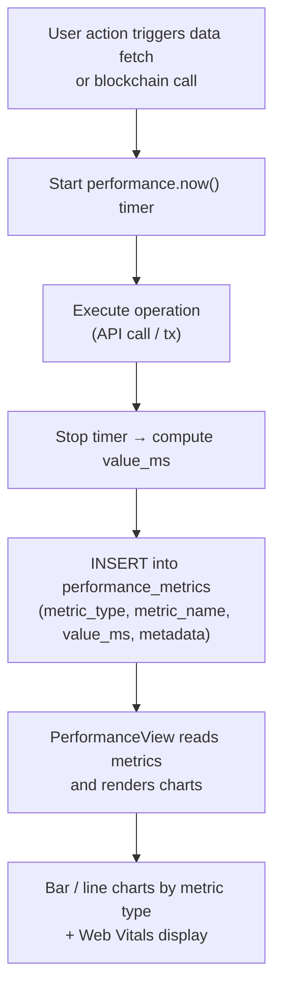

# Flowcharts

---

## 1. User Authentication Flow

---

## 2. IoT Data Recording Flow

---

## 3. Data Verification Flow

---

## 4. Wallet Connection Flow

---

## 5. Device Registration Flow

---

## 6. Performance Metrics Collection Flow

